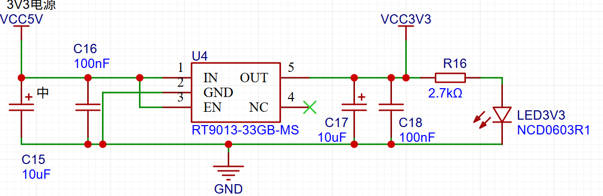

# 牛顿的苹果镖-赛季总结
- 本文档第一部分涵盖三个核心子模块：**机械子模块**、**电控子模块**和**视觉子模块**，记录我们部分设计思路、实现方案与技术细节。
- 第二部分是我们队的赛季总结，希望这些内容可以为后来人提供经验。

# 目录

- [牛顿的苹果镖-赛季总结](#牛顿的苹果镖-赛季总结)
- [目录](#目录)
- [1.机械子模块](#1机械子模块)
- [2.电控子模块](#2电控子模块)
  - [电控概述](#电控概述)
  - [硬件模块](#硬件模块)
    - [主板](#主板)
    - [电机驱动](#电机驱动)
    - [舵机转接板](#舵机转接板)
    - [PCB设计](#pcb设计)
  - [代码结构](#代码结构)
    - [执行器](#执行器)
    - [串口通信及通信协议](#串口通信及通信协议)
  - [`user/cpu0_main.c` 执行流程说明](#usercpu0_mainc-执行流程说明)
    - [初始化阶段](#初始化阶段)
    - [主循环](#主循环)
- [3.视觉子模块](#3视觉子模块)
  - [视觉概述](#视觉概述)
  - [架构总览](#架构总览)
  - [模块说明（逐模块）](#模块说明逐模块)
    - [core](#core)
    - [communicate](#communicate)
    - [vision](#vision)
  - [核心：算法模块](#核心算法模块)
    - [主要算法](#主要算法)
    - [gui](#gui)
    - [operations](#operations)
    - [utils / assets](#utils--assets)
  - [关键类与接口（API 摘要）](#关键类与接口api-摘要)
  - [运行与部署](#运行与部署)
  - [配置管理](#配置管理)
  - [调试、日志与诊断](#调试日志与诊断)
    - [常见问题与排查](#常见问题与排查)
- [4.牛顿的苹果镖\_RG2025赛季总结](#4牛顿的苹果镖_rg2025赛季总结)
  - [一、 备赛过程](#一-备赛过程)
  - [二、 成功点](#二-成功点)
  - [三、 失败点](#三-失败点)
  - [四、 经验教训](#四-经验教训)
  - [四、 本赛季成绩归因](#四-本赛季成绩归因)
  - [五、](#五)
---
# 1.机械子模块
- 对于本队的机械设计，我们主要是依靠麦克纳姆轮来使整个车身可以进行一个全向的运动，并且发射机构和存镖机构主要使通过铝型材和3D打印件来进行组装搭建，整体结构较为简单和轻巧。
- 底盘部分：我们将一块多孔铝板作为我们的地盘，好处是可以通过任意打孔来对于我们的设计方案进行随时调整，并且我们在其底盘下方利用亚克力板搭建了一个平台，以便于放入笔记本电脑，并用铜柱将其进行固定。我们使用麦克纳姆轮作为其驱动装置，并且将四个轮子内移，以便留出足够空间来经过桥洞。
- 上层发射部分：我们通过铝型材来搭建一个小型的发射架，并且利用3D打印件存镖和推进结构进行组装，发射动力来源为双极橡胶摩擦轮，推进动力来源为丝杆旋转带来的扭力。在发射装置底部，我们通过拉杆和舵机以及餐桌球轴承的组合，3D打印件的连接来使得整个发射机构可以有一个左右大约10°的转动，方便发射和存放飞镖时进行校准。并且，我们通过增设导轨的方式使得飞镖可以较为稳定的走完发射路线。
- 飞镖设计方面：为了便于抓取，我们将飞镖制作的尽量长；为了其在飞行中受到的阻力使其偏转作用较小，我们将其加细；为了使其空中可以有一个良好的姿态，我们将飞镖的重心尽量集中在前1/3处。但是我们在设计发射机构时没有考虑到飞镖的形状以及放置，导致后期飞镖尾部没有进行一个较缓的收缩以及镖身整体并非中心对称从而导致飞行姿态并不稳定。
- 不足之处：虽然整个车身在实际运行过程中因为结构基础的原因，在调试以及运行中比较方便，且运行相对也较顺畅，但是遗憾的是，机械的抗干扰性并不强，原因在于我们未考虑到车身的晃动，没有将减震做好，从而使得其受到外界影响时不能及时稳定下来（应当在底盘和视觉结构连接处增设弹簧）。并且，机械臂在调试中有着一定损耗，导致后期出现了误差的累积。

# 2.电控子模块

该文档描述 `electric_control` 下的代码结构、主要软硬件模块、硬件 IO 映射、以及与 PC 的串口通信协议（frame + TLV）。

> 项目基于`libraries/`（SeekFree/厂商库）开发，这些库的内部实现不在本文档中详述，仅说明如何使用本目录下的接口。

## 电控概述

`ele_control` 是机器人电控（MCU 端）代码的用户层实现，基于项目内提供的硬件抽象与第三方库（libraries）。本目录负责：

- 车辆底盘与电机驱动（`guandao.*`）
- 弹仓推进装置（`push.*`）
- 机械臂（`roboarm_motion.*`）
- 发射装置（`shot.*`）
- 与上位机（PC）基于自定义 frame + TLV 协议的收发（`communicate/*`）

本技术文档聚焦代码结构、接口与协议，便于移植、调试与二次开发。

## 硬件模块

### 主板

**主电源输入**
- 输入接口：XT30电源插座，type_c 5V输入，都可以防反接
- 输入电压：5V DC ±10%
- 过压保护：PMOS管 HY19P03D，稳压管BZT52C16产生压差用

<div align="center">
<figure>
    
    <figcaption></figcaption>
</figure>
</div>

**DC-DC转换电路**
- 外部稳压 24V转5V
- 3.3V转换：RT9013-33GB-MS
  - 输出电流：1A
  - 输入范围：4.5V-12V
<div align="center">
<figure>
    
    <figcaption></figcaption>
</figure>
</div>

### 电机驱动
**双路H桥驱动模块**
- 输入电压范围6-26V，元件选型用贵一点就，不用再画降压电路了直接用BZT52C3V3给芯片供电。
- 驱动芯片：DRV8701E和双H桥
- MOS管：东芝的TPH1R403NL，内阻低，过流能力极强，理论上可以过50A电流
  
<div align="center">
<figure>
    
    <figcaption></figcaption>
</figure>
</div>

- 使用缓冲芯片
<div align="center">
<figure>
    
    <figcaption></figcaption>
</figure>
</div>

### 舵机转接板
**电源接口**
- 电平转换：外部使用现成模块24V转6.5V
- 滤波：电容滤波

**PWM输出**
- 缓冲器：74HC125总线驱动器（后面因为元件数没备够删了）
- 限流电阻：100Ω串联保护


### PCB设计

**布局规划**

电源区域：
- 特征：大面积铺铜，多路电源分区
- 散热：电源芯片带散热过孔

信号区域：
- 布线：大电流路径加宽至40mil
- 隔离：数字地与功率地单点连接

**布线规范**
电源布线：
- 主电源：60mil线宽，承载3A电流
- 电机电源：80mil线宽，承载6A电流
- 地平面：完整地平面，减少环路面积，同时模拟地和信号地分离

**电源监控和管理**
电压监测点：
- 主输入：12V分压监测
- 电池电压：通过ADC1_CH5_A21监测
- 3.3V供电：直接ADC采样

**电流监测**
- 无需电流检测

**功率分配**
总功率预算：
- 主板功耗：1.2W（3.3V@360mA）
- 所有舵机功耗：最大19.5W（6.5V@3A）
- 所有电机功耗：最大120W（24V@5A）
- 保护：分点板上的10A保险丝
- 总输入功率：150W设计余量（实际比这小的多得多）


**<font size="4.5">元件选型</font>**

**核心器件**
TC264微控制器：
- 封装：LQFP176
- 温度范围：-40℃ to +85℃
- 供电电压：3.3V核心，1.2V内核
- 双内核：使用双内核的共享内存就可以实现简单实时操作系统。

DRV8701E电机驱动：
- 封装：HTSSOP16
- Rds(on)：280mΩ典型值
- 待机电流：<1μA

**被动元件**
电容电阻选型详见BOM

**连接器**
电源线接口：
- 类型：XT30连接器

信号接口：
- 类型：2x3P,2x5P牛角座
- 间距：2.54mm间距
- 线序：使用灰排线有效防反插，方便整理线路，不用像杜邦线那么麻烦。


## 代码结构

本次RG任务难度高，对稳定性要求高，且不像去年（RG2024）那样有实时计算实时决策的需求。我们没有使用RTOS，也没有使用在智能车里常用的时间片轮询。

```
ele_control/
├── libraries/          # 开发中使用的底层库
├── code/
│   ├── communicate/    
│   │   ├── protocol_c  # 协议栈（frame, data, protocol_defs）
│   │   ├── parser.*    # 接收解析器
│   │   └── sender.*    # 数据发送器
│   ├── guandao.*       # IMU接收、运动模式控制、导航辅助函数
│   ├── push.*          # 送管/推弹子模块控制逻辑
│   ├── shot.*          # 开火/触发子模块
│   ├── roboarm_motion.*# 机械臂动作序列
│   └── 本文件夹作用.txt
└── user/
    ├── cpu0_main.c     # CPU0主函数（初始化流程与主循环）
    ├── cpu1_main.c     # 第二个核心程序（未使用）
    ├── cpu0_main.h
    └── isr.*           # 启动/中断相关
```

### 执行器

**<font size="4.5">1.底盘控制 (guandao)</font>**

**功能概述**：
IMU 串口接收解析（FIFO）、惯导（INS）基础结构、底盘 motor pattern、PWM/GPIO 控制、IMU 数据解析。

**主要接口**：
- `guandao_init()` - 底盘系统初始化
- `imu_reset()` - IMU 复位
- `motion_init()` - 运动控制初始化
- `set_motion()` - 设置运动状态
- `get_imu_yaw()` - 获取 IMU 偏航角
- `INS_UpdatePosition()` - 更新位置信息

**主要算法**：使用比较经典的惯性导航算法，使用四元数，一阶滤波器等，获取每个瞬间的加速度，实现定位功能，实际上因为积分运算和采样频率不够，以及底盘电机没有编码器，只用IMU无论如何定位都会有误差（精度在10CM这样），这样的精度是无法抓取的，最后定位工作还是靠与视觉融合定位。但是维特智能IMU 提供的姿态角度参数较为稳定，可以直接使用。考虑到备赛时间和比赛时间限制，最后没在底盘采用PID算法。

---

**<font size="4.5">2.推送装置 (push)</font>**

**文件**: `push.c / push.h`

**功能概述**：
推管/送弹逻辑（编码器读数判断极限、PWM 控制、方向 GPIO），实现精确的推送控制。

**主要接口**：
- `push_init()` - 推送装置初始化
- `push_update()` - 状态更新与监控
- `push_forward_and_back()` - 前进后退控制
- `push_set_speed()` - 设置推送速度
- `push_get_position()` - 获取当前位置

**主要算法**：
编码器闭环控制。

---

**<font size="4.5">3.机械臂控制 (roboarm_motion)</font>**

**功能概述**：
机械臂动作序列控制，包括抓取、准备、回位等预设动作，通过调用底层舵机接口实现精确运动控制。

**主要接口**：
- `roboarm_init()` - 机械臂初始化
- `roboarm_grab()` - 执行抓取动作
- `roboarm_prepare()` - 准备姿态
- `roboarm_reset()` - 回位动作
- `roboarm_set_angle()` - 设置关节角度
- 还有很多

**主要算法**：
由于机械臂稳定性和分辨率不足，没有使用视觉机械臂动态控制位置和逆运动学分析，而是使用视觉精确找到底盘位置后，调用机械臂状态机抓取。
- 有限状态机
 <div align="center">
<figure>
    
    <figcaption></figcaption>
</figure>
</div>

---

**<font size="4.5">4.云台和发射控制 (shot)</font>**


**文件**: `shot.c / shot.h`

**功能概述**：
开火/触发控制模块，管理摩擦轮速度控制、单发/连发模式、发射时序等。

**主要接口**：
- `shot_init()` - 发射系统初始化
- `shot_fire_once()` - 单发射击
- `shot_fire_continuous()` - 连发射击
- `shot_stop()` - 停止射击
- `shot_set_speed()` - 设置摩擦轮速度

**主要算法**：
- 由于无刷电机转速对电压比较敏感，这里没有采用开环控制，而是在视觉找定位置后，使用ADC反馈的电压调整PWM输出参数。
- 云台融合视觉，通过前置摄像头看绿灯，使用PID迭代调整位置，最终高台打大本营的精度可以达到3中2（到最后都没时间打出去）。

---

### 串口通信及通信协议

本系统在 MCU 与上位机之间采用轻量、可扩展的三层串行协议：Frame 层负责帧边界与完整性校验；Data 层以 TLV（Type-Length-Value）格式组织多个变量；Variable 层负责变量 ID、固定宽度约束与语义映射。该设计兼顾了传输可靠性、协议可演进性与上位机/嵌入式端实现复杂度的平衡。

以下内容同时引用并说明工程中的实现位置：
**协议层**：`communicate/protocol_c/frame.*`（frame 层）、`communicate/protocol_c/data.*`（TLV 编解码）、`communicate/protocol_c/protocol_defs.h`（变量与固定宽度表）
**应用层**：`communicate/parser.*`（流式解析与分发）、`communicate/sender.*`（发送封装）。

---

**1.Frame 层（边界、长度与校验）**

帧定义（字节序列）为：

```
0xAA | LEN | VER | SEQ | CHK | DATA[LEN-3]... | 0x55
```

- LEN（1 字节）：等于 3 + N，其中 N 为 DATA 字节数（VER+SEQ+CHK 之外的 DATA 长度）。因此 DATA 的最大字节数为 252（0xFF - 3）。
- VER（1 字节）：协议数据版本（与 `protocol_defs.h` 中的 PROTOCOL_DATA_VER 匹配用于向后兼容检查）。
- SEQ（1 字节）：报文序列号，用于上位机/MCU 区分重复帧和检测丢包。
- CHK（1 字节）：帧头后到 DATA 前一段的校验（实现文件 `frame.c` 中有校验算法，接收端在解析时会验证，错误返回 PCMCU_ECHECKSUM）。
- HEAD/TAIL：头（0xAA）与尾（0x55）作为定界符。

实现要点：
- 使用 `pcmcu_build_frame()` 构建帧并返回完整字节序列；使用 `pcmcu_stream_feed()` 在接收端以流式方式喂入字节缓冲，库会在找到完整帧后回调 `pcmcu_on_frame_fn`。
- 流式解析器使用固定大小的内部缓冲（`PCMCU_STREAM_MAX_BUF`，默认 512）；当缓冲溢出或出现格式错误时，解析器会丢弃最早的字节以保持对“最新数据”的偏好（left-trim 策略）。
- 错误码：frame 层会返回详细错误码（如 PCMCU_ELEN_INVALID / PCMCU_EFRAME_TOO_SHORT / PCMCU_ECHECKSUM），上层应根据需要记录或回报错误。

---

**2.Data 层 & TLV（变量封装）**

Data 层使用 TLV（1B Type, 1B Length, L bytes Value）打包任意多个变量项到 DATA 区域。为减少解析与校验开销，工程同时维护了一个固定宽度表 `VAR_SIZE_TABLE[256]`，当某个变量在表中对应非零值时，接收端会强制要求 L 等于该固定值（避免长度混淆与类型不匹配）。

核心 API（定义在 `data.h`）：
- `data_put_u8/u16le/u32le/f32le()`：写入基础类型为一个 TLV 项。
- `data_put_tlv(buf, cap, w, t, v, l)`：在缓冲 `buf` 的写指针 `w` 处写入一项 TLV，返回新写指针或错误。
- `data_put_var(...)`：根据 `VAR_SIZE_TABLE` 校验固定宽变量并写入；若长度与表不匹配，返回 DATA_ESIZE 错误。
- `data_encode(msg, ver, tlv_bytes, tlv_len, out_buf, out_cap, &out_data_len)`：在给定 tlv 字节序列情况下，构建 DATA 区域（含消息类型/版本等）供 frame 层封装。
- `data_decode(data, data_len, &out_msg, &out_ver, on_tlv_cb, user)`：解码 DATA 中的所有 TLV，每遇到一项即调用 `on_tlv_cb(t, v, l, user)`；回调返回非 0 时可提前中止解析。

设计与鲁棒性要点：
- 对于固定宽变量，务必通过 `data_put_var` 或 `data_put_var_f32` 等接口构建，这样编解码两端长度约束一致。
- `data_validate_tlvs()` 可用于对未知/外部数据做快速一致性检查（检查边界、长度与不越界）。

**3.Variable 层（VAR ID 与语义）**

变量 ID 与固定宽度定义在 `protocol_c/protocol_defs.h`，该文件由生成脚本维护。每个变量包括：
- 名称（宏名，如 `VAR_FRICTION_WHEEL_SPEED`）
- ID（0..255）
- 固定宽度（若适用，例如 float32 占 4 字节）


完整变量表参见仓库：`electric_control/ele_control/protocol_vars.csv`。

**4.解析与分发（在 MCU 端的实现细节）**

核心流程（基于 `parser.c` 的实现）：

1. 串口中断/底层驱动将接收字节写入软 FIFO（ISR 中只做最小处理）。
2. 主循环或专用任务从 FIFO 中批量读取字节并调用 `parser_feed_stream(data, len)`。
3. `pcmcu_stream_feed()` 在内部累积字节并在发现完整帧时回调 `on_frame_callback(frame, frame_len, user)`。
4. `on_frame_callback` 调用 `pcmcu_parse_frame_data()` 抽取 DATA 字段，然后调用 `data_decode()` 遍历 TLV 项。
5. `data_decode` 在遇到每一项 TLV 时，触发 `on_tlv_callback(t, v, l, user)`；该回调负责将变量分发到具体模块（底盘/推送/射击/机械臂等），并将需要的响应写入响应缓冲（例如 `add_response_to_buffer`）。
6. 当前帧处理完毕后，若响应缓冲非空，调用 `sender_send_multiple_tlv()` 将所有响应打包并通过发送回调写出串口。


---

## `user/cpu0_main.c` 执行流程说明

### 初始化阶段

1. **基础初始化**：
   - `clock_init()` - 时钟初始化
   - `debug_init()` - 调试串口初始化

2. **协议与解析器初始化**：
   - `sender_init(sender_callback, NULL)` - 发送器初始化
   - `parser_init()` - 解析器初始化

3. **模块初始化**：
   - `guandao_init()` - 底盘初始化
   - `push_init()` - 推送模块初始化
   - `roboarm_init()` - 机械臂初始化
   - `shot_init()` - 射击模块初始化

4. **等待其他核就绪**：
   - `cpu_wait_event_ready()`

### 主循环

```c
while (1) {
    // 从串口环形缓冲读取数据
    debug_read_ring_buffer(read_data, 32);
    
    // 数据解析与处理
    if (有数据) {
        parser_feed_stream(read_data, fifo_data_size);
    }
    
    // 可选：周期性发送心跳
    // sender_send_u8(VAR_HEARTBEAT, 0x00);
}
```

**设计要点**：将 IO/外设初始化与协议栈初始化放在主函数前期，主循环仅负责把串口收数据交给解析器。


---

# 3.视觉子模块

该文档描述 `vision/RG2025Vision` 子系统的架构、主要组件、关键接口、运行/部署流程、配置与调试建议，以及扩展点和测试指南。


## 视觉概述

RG2025Vision 是为 RoboGame2025 比赛实现的视觉子系统。目标是提供稳定的摄像头管理、目标检测（AprilTag / HSV）、基于检测的定位、本地 Web GUI 调试面板，以及与下位 MCU 的可靠串口协议层。系统设计侧重于模块化、可配置性与工程实践（配置持久化、日志、异步 IO 与线程安全）。

实现语言：Python 3.x
主要框架/库：OpenCV, pyserial, NiceGUI, numpy, apriltag（或其 Python 实现）

代码位置：`vision/RG2025Vision`。

---

## 架构总览

以下节使用与 `TECHNICAL_ele.md` 相同的“代码架构”表达方式，便于快速定位实现文件与理解运行时行为。

高层流程（快速可读版）：

- 启动：运行 `main.py` -> `gui.launch()`（NiceGUI），在 `on_startup` / `on_shutdown` 注册生命周期回调。
- 初始化（`on_startup` 回调）：
  - 调用 `vision.runtime.init_vision()`：构建并注册 `VisionSystem` 单例（扫描/初始化摄像头、加载检测器与相机内参、恢复配置）。
  - 调用 `communicate.serial_app.init_serial()`：初始化 `SyncSerial`，绑定帧/数据 codec（`FrameCodec`/`DataCodec`）并注册接收回调。
- 运行：GUI 页面或后台任务通过 `VisionSystem` 提供的 API（读帧、检测、定位）完成视觉推理；通过 `serial_app.send_tlvs()` 与 MCU 做命令/上报交互。

并发模型（关键并发边界与锁策略）：

- 摄像头 I/O：每个物理摄像头通常由 `Camera` 对象在独立线程或后台 worker 中做 frame capture（避免阻塞 UI）。
- 检测任务：对耗时的检测（例如 AprilTag 解算）应当在独立线程池或工作队列中执行，检测结果异步写回 `VisionSystem` 的缓存。
- 串口 I/O：`SyncSerial` 在单独的后台线程中循环读取字节流，读取到完整帧后通过回调交给 `serial_app`（接着由 `DataCodec` 解码为 TLV 并派发）。
- 共享数据保护：
  - `VisionSystem` 单例（常见名称 `_vs`）与最新帧/检测结果通过 `threading.Lock` 或更细粒度锁保护；建议按资源（frame cache / config / latest_decoded_frame）划分锁以减少竞争。
  - 对于跨线程的“长时间任务”，应采用生产者/消费者队列（`queue.Queue`）或事件/任务系统，避免在串口回调或摄像头采集线程中做阻塞操作。

项目树：

```
vision/RG2025Vision/
├── main.py                 # NiceGUI 启动与 on_startup/on_shutdown 注册
├── environment.yml        # 推荐 Conda 依赖
├── core/
│   ├── logger.py          # 日志封装（控制台/文件/GUI 通知）
│   ├── paths.py           # 配置与路径常量
│   └── config/            # 配置 dataclass 与 (de)serializers
├── communicate/
│   ├── serial.py          # SyncSerial：串口线程与回调
│   ├── serial_app.py      # 上层服务：frame/data codec 适配与便捷接口
│   └── protocol/          # protocol_py（自动生成），codec 工具
├── vision/
│   ├── vision_system.py   # VisionSystem 核心管理（摄像头、检测器、localizer）
│   ├── camera/            # Camera 抽象与后端适配（scan_cameras）
│   ├── detection/         # AprilTag / HSV 等检测器实现
│   └── localization/      # 单 Tag 定位器等
├── gui/
│   ├── gui_app.py         # NiceGUI 页面与路由
│   └── pages/             # 各页面实现（Debug/Config/...）
├── operations/            # 任务流/演示序列
├── utils/                 # 标定/工具函数
└── assets/                # 测试图片 / apriltag 图集
```

运行时“契约”（小型 contract，输入/输出/错误模式）：

- 输入：摄像头帧（np.ndarray）、外部串口 TLV 请求、配置文件（JSON/dataclass）。
- 输出：检测结果（TagDetection/HSVDetection）、位姿（CameraPose）、通过 `serial_app` 发出的 TLV 回应/上报、日志与 GUI 更新。 
- 错误模式：摄像头丢帧/打开失败、串口帧校验/版本不匹配、检测器抛出异常。对外策略：尽量将错误降级为可观测的日志/GUI 报警，并用异步任务重试或在上层返回 `VAR_ERROR`/错误码。


---

## 模块说明（逐模块）

下面按目录列出并说明各模块的职责与关键实现文件。

### core

- `core/logger.py`：统一日志方案，支持控制台、文件和 NiceGUI 前端通知（`UiHandler`）。日志级别与日志文件管理封装在 `Logger` 类中。
- `core/paths.py`：项目路径与配置文件常量（`.config` 目录、VISION_CONFIG_PATH、SERIAL_CONFIG_PATH 等）。
- `core/config`：配置加载/保存工具，支持 dataclass -> JSON 的宽松序列化/反序列化。

用途：提供通用基础设施（日志、路径、配置），其他模块应依赖这些接口而非直接使用第三方 API。

### communicate

- `communicate/serial.py`：`SyncSerial`，串口封装，提供线程安全的打开/关闭、发送、后台接收和回调注册。
- `communicate/serial_app.py`：上层服务封装，负责：端口扫描、配置加载/保存、frame/data codec 适配（`FrameCodec`、`DataCodec`）、最新帧缓存与同步访问、以及向上暴露 `send_tlvs`, `send_kv` 等便捷接口。
- `communicate/protocol/`：协议定义与生成器；`protocol_py` 是 Python 端的自动生成产物（包含变量 ID、消息类型、data 编解码器），`protocol_c` 为 MCU 用 C 版本。

交互说明：`serial_app` 在收到字节时调用 codec.feed() 获得完整帧，解析 DATA 部分为 TLV，再通过 `_latest_frame_decoded` 暴露给 UI 或其他服务。

### vision

- `vision/vision_system.py`：`VisionSystem` 是核心类，负责管理 `Camera` 实例、检测器（Tag36h11/25h9、HSV）、localizer（`SingleTagLocalizer`）、以及提供读帧/检测/定位接口（例如 `read_frame`, `detect_tag36h11`, `locate_from_tag`, `get_config`）。
- `vision/camera/`：摄像头抽象、枚举与后端适配。`scan_cameras()` 用于发现设备并创建 `Camera` 对象。
- `vision/detection/`：检测器实现（AprilTag、HSV 等），各检测器封装成可配置对象，支持 `get_config()` 与 `detect()`。
- `vision/localization/`：简单定位器实现（单 Tag 局部定位），将检测结果与相机内参转为相对位姿。

设计要点：检测器与 localizer 可在 VisionSystem 中互换/组合；检测结果与位姿数据结构保持一致（如 `TagDetection`, `CameraPose`），便于 GUI 与操作模块消费。

---

## 核心：算法模块

本节描述 `RG2025Vision` 中使用的主要算法、实现位置与参数/性能建议。将算法独立为一个逻辑模块方便测试、替换与优化。

代码位置（建议/已有实现）：
- `vision/detection/`：检测算法实现（AprilTag、HSV、其它）。
- `vision/localization/`：位姿估计（PnP、RANSAC、卡尔曼/平滑器）。
- `vision/utils/`：相机标定（`camera_calibration.py`）、图像预处理与滤波工具。

### 主要算法

- AprilTag 检测（Tag36h11 / Tag25h9）：
  - 用途：高可靠性的几何标签检测，用于定位与姿态估计。
  - 实现：`vision/detection/apriltag_*.py`（或 `detection/tag36h11.py`），调用底层 C/Python apriltag 库或 OpenCV 的相关接口。
  - 性能提示：对输入图像做灰度化并可选下采样（decimation）以提高速度；在多摄像头场景采用 ROI 限定检测区域。
  - 可调参数：tag_family、decimate、blur、edge_thres、tag_size（用于 PnP）。

- HSV（基于阈值的颜色分割）：
  - 用途：识别颜色目标（例如绿灯、目标区域），作为轻量级快速检测方法。
  - 实现：`vision/detection/hsv_detector.py`，步骤通常包括：BGR->HSV、阈值裁剪、形态学开闭运算、连通域/轮廓筛选。
  - 性能提示：使用预计算 LUT（若适用），尽量在较低分辨率上运行以减少 CPU 负担。
  - 可调参数：H/S/V 范围、形态学内核尺寸、最小/最大轮廓面积。

- 位姿估计（PnP / 单 Tag 定位）：
  - 用途：将检测到的 Tag 的像素坐标与已知的三维标签角点映射到相机坐标系，得到位姿（平移 + 旋转）。
  - 实现：`vision/localization/pnp_localizer.py`，使用 OpenCV `solvePnP`（推荐 `SOLVEPNP_ITERATIVE` 或 `SOLVEPNP_IPPE_SQUARE` 视情形而定），对抗异常使用 `RANSAC` 或外点剔除。
  - 后处理：对位姿做时间滤波（低通 / EMA / 卡尔曼滤波）以减少噪声并提高稳定性。

- 相机标定与畸变校正：
  - 用途：精确的相机内参（fx, fy, cx, cy）和畸变系数是 PnP 与精确测量的前提。
  - 实现：`vision/utils/camera_calibration.py`（棋盘格/圆点标定），保存并加载内参文件（`core.paths.VISION_CONFIG_PATH` 下或 camera-specific config）。
  - 建议：在部署设备上运行标定并保存内参；对多摄像头确保每台相机单独标定。

- 预处理与滤波：
  - 常用操作：resize、灰度化、Gamma 校正、直方图均衡、Gaussian blur、median/ bilateral filter、undistort。
  - 检测前的ROI/金字塔缩放策略可在保证精度的前提下降低计算量。

- 稳定化与后处理：
  - 对检测到的位姿做时间平滑（EMA/简单一阶低通），对目标追踪可结合简单的匀速模型预测以提高鲁棒性。
  - 对于可能的误检，可使用短期历史一致性检查（例如要求连续 N 帧出现或 IOU / 距离稳定）后才触发关键动作。

测试与性能验证：

- 基准方法：在目标机（比赛笔记本）上测量每个检测器在不同分辨率下的平均延迟（ms/frame）与 CPU 利用率。
- 回归测试：使用 `assets/` 中的测试图片运行检测器，记录检测率、误报率与定位误差（单位：cm/deg）。

实现注意事项（工程实践）：

- 将耗时算法放入线程池或异步队列，避免占用主线程或摄像头采集线程。
- 将算法参数放在配置（`VisionSystemConfig`）中并支持热更新以便于调参。
- 在可能的地方使用向量化 numpy / OpenCV 原生函数；若需要更高性能可考虑使用 OpenCV + TBB 或编译时开启优化。

---

### gui

- `gui/gui_app.py`：NiceGUI 路由与页面注册（`render_nav_drawer`, 各 `@ui.page` 注册）。
- `gui/pages/`：包含主页面、调试页与配置页的渲染函数，页面通过后端服务（VisionSystem、serial_app）进行操作绑定。

注意：GUI 应尽量只做展示与参数输入，不直接承担耗时检测任务；页面操作应调用后端服务并异步等待结果或在后台轮询。

### operations

- `operations/`：任务流引擎与节点（task/condition 等），用于组合高层机器人动作序列（主要用于集成测试或演示）。

### utils / assets

- `utils/`：相机标定与图像处理辅助函数。
- `assets/`：测试图像、AprilTag 图集等资源。

---

## 关键类与接口（API 摘要）

下面列出最常被调用的类与方法，便于快速集成。

- VisionSystem
  - `init_vision() -> VisionSystem` (vision.runtime)
  - `get_vision() -> VisionSystem`
  - `VisionSystem.read_frame(key)` -> np.ndarray | None
  - `VisionSystem.get_latest_frame(key)` -> np.ndarray | None
  - `VisionSystem.detect_tag36h11(frame, intrinsics, tag_size)` -> List[TagDetection]
  - `VisionSystem.detect_hsv(frame)` -> List[HSVDetection]
  - `VisionSystem.locate_from_tag(detection)` -> CameraPose
  - `VisionSystem.get_config()` -> VisionSystemConfig

- Serial / Protocol
  - `serial_app.init_serial(port=None)` -> SyncSerial
  - `serial_app.start_serial()` / `stop_serial()`
  - `serial_app.send_tlvs(tlvs, msg=None, ver=None, seq=None)` -> None
  - `serial_app.get_latest_frame()` -> (frame_bytes, data_bytes, decoded)

- GUI
  - `gui.launch(on_startup=None, on_shutdown=None, host, port)`

---

## 运行与部署

环境：`environment.yml` 定义了推荐 Conda 环境（包含 OpenCV, numpy, pyserial, nicegui 等）。

快速启动（PowerShell 示例）：

```powershell
conda env create -f environment.yml -n rg2025vision
conda activate rg2025vision
python main.py
```

运行说明：

- GUI 默认监听 `0.0.0.0:8080`（可通过 `gui.launch()` 参数修改）。
- GUI 启动时，会在 `on_startup` 中调用 `init_vision()` 与 `init_serial()`，因此请确保摄像头与串口权限可用。

部署建议：在开发机上以 Conda 环境运行；在部署环境（例如比赛笔记本或边缘计算设备）建议使用虚拟环境（venv）或容器（Docker）将依赖锁定。

---

## 配置管理

- 配置路径由 `core.paths` 定义（`.config` 目录）：`VISION_CONFIG_PATH`, `SERIAL_CONFIG_PATH`, `FIELD_CONFIG_PATH` 等。
- 使用 `core.config` 的加载/保存函数处理 dataclass 配置，`VisionSystem.get_config()` 返回 `VisionSystemConfig`，可用 `save_config()` 持久化。
- 配置策略：向后兼容（缺字段使用默认值），建议在版本更新时保留旧字段或在加载阶段进行迁移处理。

---

## 调试、日志与诊断

- 日志：`core.logger.Logger` 支持控制台、文件以及 NiceGUI 前端通知（用于实时告警）。调用 `logger.enable_file()` 开启文件记录。
- 调试入口：GUI 的 Debug 页面提供帧查看、检测结果展示与协议交互面板，便于联调摄像头/检测与下位机通信。
- 常用诊断步骤：
  1. 检查摄像头是否被 `scan_cameras()` 枚举并在 GUI 中可见。
  2. 在 Debug 页面执行 `read_frame()` 并观察是否返回有效图像。
  3. 使用 `detect_tag36h11()` 与样例图片确认检测器结果。 

---

### 常见问题与排查

- 无法打开摄像头：检查 OpenCV 后端支持（Windows: MSMF，Linux: V4L2）；查看 `scan_cameras()` 的输出。
- 串口无法连接：检查端口名称/权限并确认未被占用；使用 `serial_app.scan_serial_ports()` 获取可用端口列表。
- 协议版本不匹配：确认 `protocol_py/protocol_defs.py` 与 MCU 的 `protocol_c/protocol_defs.h` 使用相同 `PROTOCOL_DATA_VER`。

# 4.牛顿的苹果镖_RG2025赛季总结

## 一、 备赛过程
- 首先是计划书撰写，没能领到底盘，让我们后续备赛比较被动。
- 一审时搭出了空气，没法通过。队长去购买现成的底盘，和机械一起紧急搭发射机构，现成底盘价格较高，我们不知道后续能走多远，于是不太敢买物资，所以底盘配套的没有编码器的电机就这么用到了比赛最后。一审后，两位有一定工程经验的经验电控和视觉成员要准备别的比赛，没有推进度。
- 7月25日，两位成员正式介入，开始推进度，电控开始自底向上设计，开始画电路板；视觉算法开始自上而下做架构工作；机械开始安装机械臂，制作飞镖。电控8月初回家前制作好所有电路，底盘才开始动起来了，视觉做了初步的架构，靠着能简单移动的底盘，能动的机械臂，一个能转的无刷电机过了二审。8月初队员陆续回家，没推进度。
- 再次碰我们的机器已经是9月5日。从这时开始，电控才制作好第二个版本的电路板，搭建各个模块的代码，完善向上层的接口；视觉继续完善了架构，开始向下的工作，调摄像头，识别tag测试，写web来方便远程调试，做向下的接口。较为简单的机械确实让电控少控制一些执行器，于是电控视觉也开始参与机械工作，开始画一些零件图，重装机械臂，加固各个机械部件，同时各敲各的代码。终于在三审几天，视觉和电控代码成功对接，所有电路模块整体装车，布线；三审前两天完善好电控和视觉的参数，靠可以做到抓取一个普通飞镖和随意发射，正常通过三审。
- 三审后，就是视觉算法开始写抓取三个普通飞镖，上台阶，抓取三个战略飞镖，发射飞镖的流程；电控负责新增流程的底层实现，随后进入“调参-加固机械”的循环；机械和电控制作好存镖机构，调整飞镖。最终我们的机器在测试中做到稳定抓取，普通镖打哨所稳定3中2且至少中一个，战略镖在高台打大本营稳定3中2且至少中一个。从没有出现过取了3个镖但没打中的情况。

## 二、 成功点

1.我们能用较短的时间完成既定目标，至少从9月份开始，项目管理到位，知道什么时间该做什么。
2.三位低年级队友几乎是在课余时间随叫随到，尽力解决问题。
3.两位高年级同学用上几乎所有课余时间和一部分课内时间去做好一项工程。

## 三、 失败点

1.所有队员前期时间投入不足，导致很多问题在后面难以解决。
2.购买机械臂时，我们没人想到应该使用好一点的机械臂云台，导致后面花了大量时间做加固工作。后期电控也没有足够的勇气去整体更换机械臂，调参。
3.电控一直想用打补丁的方式解决问题。
4.比赛时未能预留充足的时间余量，导致只有有地方出现失误，就没能走完全流程。
5.初期太过于专注省经费，而比赛到最后还剩下不少经费，应该合理规划经费来获得更稳定的系统的。

## 四、 经验教训
1.在大型项目架构的初期，必须坚守架构的纯粹性与稳定性，对任何临时方案所引入的“技术债务”应保持零容忍态度。
（早点还清技术债，越到后面利滚利就越来越难还咯。。。）
2.大型系统工程必须贯第一次就把事情做对，同时确保所有补丁被及时、彻底地重构或替代。
（技术债 == 机械，电控，视觉的各种补丁；还债 == 重构）

## 四、 本赛季成绩归因

能到八强原因：进入八强之前机械臂没有出错。
没进四强原因：机械臂云台在最后关头竟然歪了。

## 五、

比较遗憾的是没时间传授给低年级队友多少东西，希望牛顿的苹果镖队的24级队员今后做比赛时能把学习新东西放在第一位，让热情成为驱动力。
希望队里的23级队员以后能去到想去的地方。

---
感谢带我入门竞赛和传授给我知识的学长学姐和队友。
cqt 
2025.10.14