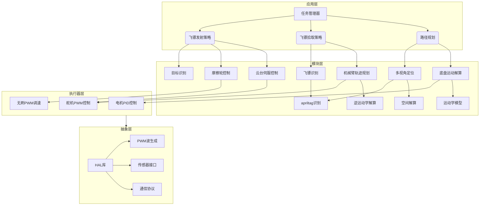
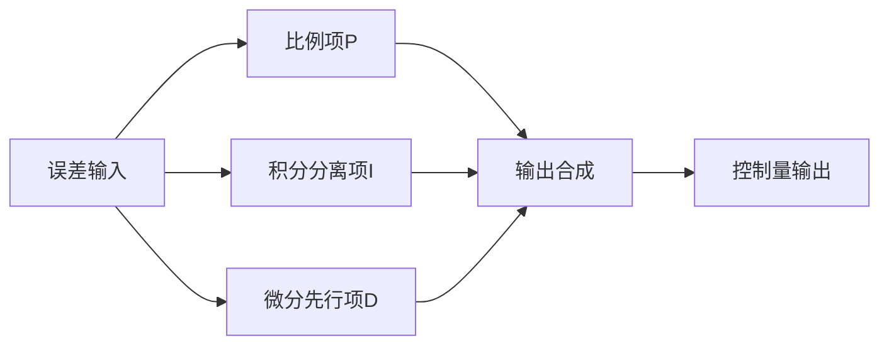
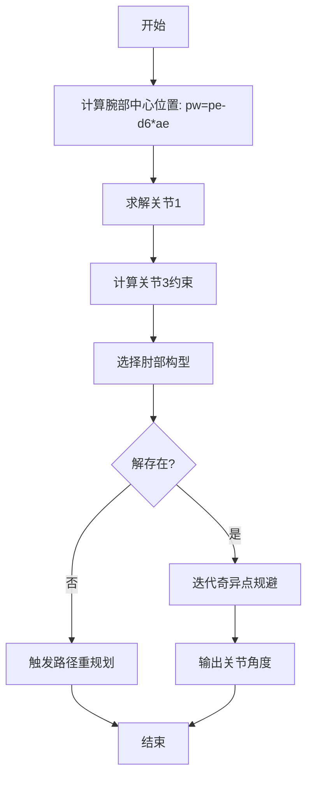
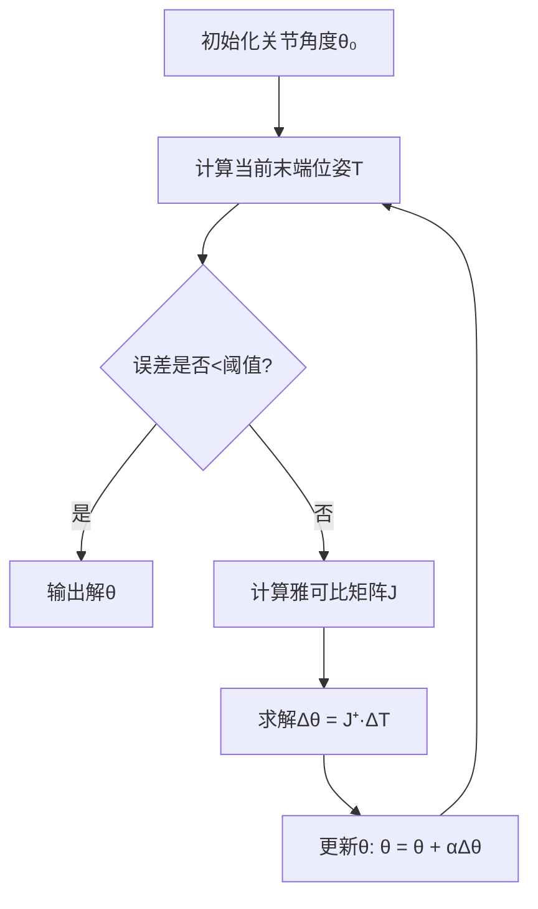
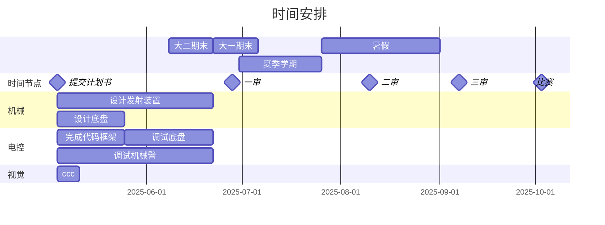

## 1. 队伍简介

### 1.1 队名介绍

### 1.2 成员介绍与分工


## 2. 机械部分

### 2.1 功能与结构概述

### 2.2 模块设计与选型

#### 2.2.1 底盘

选用四轮四驱底盘

轮胎：


## 3. 电路部分

### 3.1 电路框图

TODO: 是否选用充电宝？3.1, 3.2 需要修改


### 3.2 供电系统

#### 3.2.1 电源

技术规格：

- 电池组：AeroEggTech 21700（6S1P）
- 电芯：天津力神牌21700
- 输出电压：24V（额定22.2V）
- 容量：4000mAh
- 重量：400g
- 放电倍率：10C

TODO: 插入图片

#### 3.2.2 分电方案

- 核心组件：Robogame 官方分电板
- 输入：24V 电源接口
- 输出：多路稳压/降压输出

#### 3.2.3 稳压方案

电源电压为24V，而主控，树莓派，等模块需要稳定的小于24V的电压。所以我们考虑需求:

1. 没有电路模块需要24V以上电压，不需要升压
2. 提供稳定电压输出 
3. 对部分功耗大的模块，要保证电源效率。

综上，我们选择开关电源中的buck降压电路，进而选择LM2596S稳压模块成品，实物图如下。其中纹波系数，电压电流参数均符合要求，为方便检测电压，均使用带数显的版本；为方便接线，后续我们将把接电端口改成XT60。而根据LM2596S的数据手册，我们将适当更换贴片电阻，获得更多的固定电压。


#### 3.2.4 急停开关

- 型号：TB38-11ZS
- 额定电流：10A


### 3.3 控制系统

#### 3.3.1 主控模块

考虑性价比和上手难度，我们选择逐飞科技的TC264D最小系统板，并自行设计主控电路板

- 核心芯片：SAK-TC264D-40F200N
- 特性：
  - **TriCore™多核架构**：32位高性能处理器，主频200MHz，集成浮点运算单元（FPU）。
  - **大容量存储**：2.5 MB Flash + 240KB RAM，支持复杂算法与数据缓存。
  - **丰富外设接口**：集成ADC、PWM、正交编码器接口、CAN/串口通信模块，适配实时控制需求。
  - **灵活中断系统**：255级可编程中断优先级，确保高实时任务响应。
  - **开发便捷性**：官方工具链（AURIX Development Studio）+ 开源库支持，提供智能车竞赛专用例程。
  - **多核协作能力**：支持双核配置，需手动优化资源分配。
  - **高性价比应用**：广泛用于智能车（电机驱动、传感器融合）及工业实时控制场景。


#### 3.3.2 计算平台

直接使用笔记本电脑作为计算平台。笔记本型号是Thinkbook16+ 2024


这款电脑自带NPU，因此可以考虑使用YOLO模型识别飞镖

### 3.4 执行系统

#### 3.4.1 轮轴电机  

轮轴电机需要有更大的力矩带动正台机器人的运动，结合简单计算和冗余设计的原则，并结合电源供电能力，我们采用MD36NP27-24V行星减速电机。技术方案如下

- 型号：MD36NP27-24V行星减速电机
- 特性：
  - 集成编码器，方便进行闭环控制
  - 适配24V电源系统
  - 配备电机支架，方便机械设计


#### 3.4.2 摩擦轮电机  

由于飞镖上无法装配MCU，摩擦轮电机需要更大的转速和扭矩，来给飞镖更大的加速度，保证飞行距离和稳定性。为满足要求，我们采用群汐无刷电机QM4208 380KV并搭配并搭配好盈乐天电调 40A ，参数如下图所示。


#### 3.4.3 机械臂舵机

我们计划使用喷砂铝合金作为机械臂机体材质，为保证机械臂的灵活性和抓力，选用LDX15Kg/180°舵机

- 特性：
  - 堵转扭矩15kg·cm
  - 运动范围0-180°
  - 响应速度0.16s/60°


#### 3.4.4 机械臂底盘舵机

底盘需要更大扭矩和旋转角度，我们采用HPS-3527G 35Kg/270°舵机

- 特性：
  - 最大扭矩35kg·cm
  - 270°旋转角度
  - 金属齿轮组


#### 3.4.5 电机驱动

考虑到我们使用24V电源，MD36NP27的最大堵转电流为7A，所以使用XY-160D模块做为电机驱动方案，一个驱动模块可以驱动两个电机。

- 电气参数：
  - 输入电压：DC 6.5-27V
  - 单路电流：7A(持续)/15A(峰值)
  - PWM响应：5μs


---

### 3.5 传感器

#### 3.5.1 摄像头

机械臂摄像头：MT9V034

其他摄像头：2*USB免驱摄像头1080P


#### 3.5.2 编码器  

为了对电机进行更佳精准的闭环控制，我们选用1024线编码器。具体参数如下。

- 关键参数：
  - 分辨率1024PPR
  - 响应频率100kHz
  - 工作电压3.3 ~ 5V
  - 工作电流 13.6mA

TODO: 换图


### 3.5.3 位姿传感器  

为了对机器人进行精确的位姿校准，我们选用维特智能6轴传感器模块WT61PC。具体参数如下。


## 4. 算法部分

### 4.1 控制程序架构



### 4.2 主控程序设计方案

#### 4.2.1 流程规划


方案不考虑拾取敌方的战术飞镖

#### 4.2.2 控制算法

##### 底盘控制

###### PID

PID是一种常用的算法




###### 麦轮解算

运动学方程：
$$
\begin{bmatrix}
v_{x} \\ 
v_{y} \\ 
\omega 
\end{bmatrix}
= \frac{1}{4}
\begin{bmatrix}
1 & 1 & 1 & 1 \\ 
-1 & 1 & 1 & -1 \\ 
\frac{-1}{l_x + l_y} & \frac{1}{l_x + l_y} & \frac{-1}{l_x + l_y} & \frac{1}{l_x + l_y}
\end{bmatrix}
\begin{bmatrix}
\omega_1 \\ 
\omega_2 \\ 
\omega_3 \\ 
\omega_4 
\end{bmatrix}
$$


##### 机械臂控制




###### 逆运动学解算

使用数值法求解逆运动学流程


其中的关键在于雅各比矩阵构造

```mathematica
 J = [∂x/∂θ₁  ∂x/∂θ₂  ...  ∂x/∂θₙ;
     ∂y/∂θ₁  ∂y/∂θ₂  ...  ∂y/∂θₙ;
     ∂z/∂θ₁  ∂z/∂θ₂  ...  ∂z/∂θₙ;
     ∂φ/∂θ₁  ∂φ/∂θ₂  ...  ∂φ/∂θₙ]
```

###### 轨迹规划

采用六次多项式轨迹方程
```mathematica
θ(t) = θ_0 + θ_1 t + θ_2 t² + θ_3 t³ + θ_4 t⁴ + θ_5 t⁵ + θ_6 t⁶
```


飞镖落点控制

预先收集数据，得到发射落点依赖发射速度的分布
$$
P_{\text{land}} = f(v_0,\phi) + \mathcal{N}(\mu,\sigma^2)
$$

### 4.3 视觉方案

#### 多视角定位

多个摄像头检测到至少2个apriltag，可以计算出tag中心到摄像头的角度

建立观测方程：
$$
\begin{cases}
u = f_x\frac{X}{Z} + c_x \\
v = f_y\frac{Y}{Z} + c_y 
\end{cases}
$$
多标签定位优化：
$$
\hat{P} = \arg\min_P \sum_{i=1}^n w_i\left\|p_i - \pi(P,T_i)\right\|^2
$$


#### 飞镖识别

在战术飞镖上放置apriltag，同时在机械臂上放置摄像头


## 6. 经费预算


## 7. 时间安排




### 4.2 运动控制算法

#### 自适应PID控制

改进型PID算法：

- **积分分离**：误差较大时自动关闭积分项
- **微分先行**：仅对测量值微分，避免设定值突变
- **公式**：
  u(k)=Kpe(k)+βKi∑e(i)T+KdΔeT*u*(*k*)=*K**p*​*e*(*k*)+*β**K**i*​∑*e*(*i*)*T*+*K**d*​*T*Δ*e*​

#### 全向底盘控制

**运动解算**：

ωi=1r[1−1−0.32110.32...][vxvyω]*ω**i*=*r*111...−11−0.320.32*v**x**v**y**ω*

**优化**：硬件加速解算（<0.3ms）

------

### 4.3 机械臂控制

#### 运动学建模

- **D-H参数法**构建6自由度模型
- **工作空间**：半径0.5-1.2m球域

#### 轨迹规划

**五次多项式插值**：
θ(t)=a0+a1t+...+a5t5*θ*(*t*)=*a*0​+*a*1​*t*+...+*a*5​*t*5
**约束**：

- 最大角速度 ≤180°/s
- 加速度连续

------

### 4.4 视觉算法

#### 定位融合

1. 三相机同步采集
2. AprilTag检测（Tag36h11）
3. LM算法优化位姿

#### 飞镖识别
