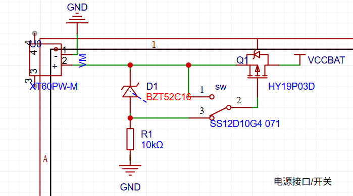
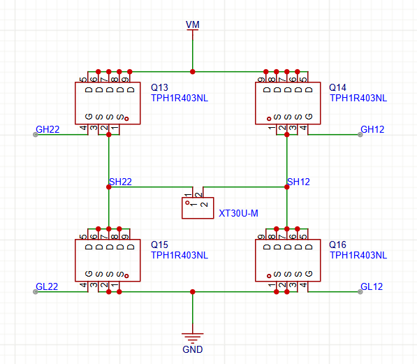
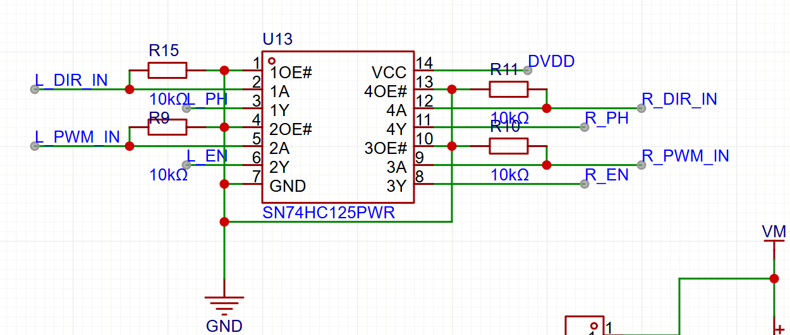
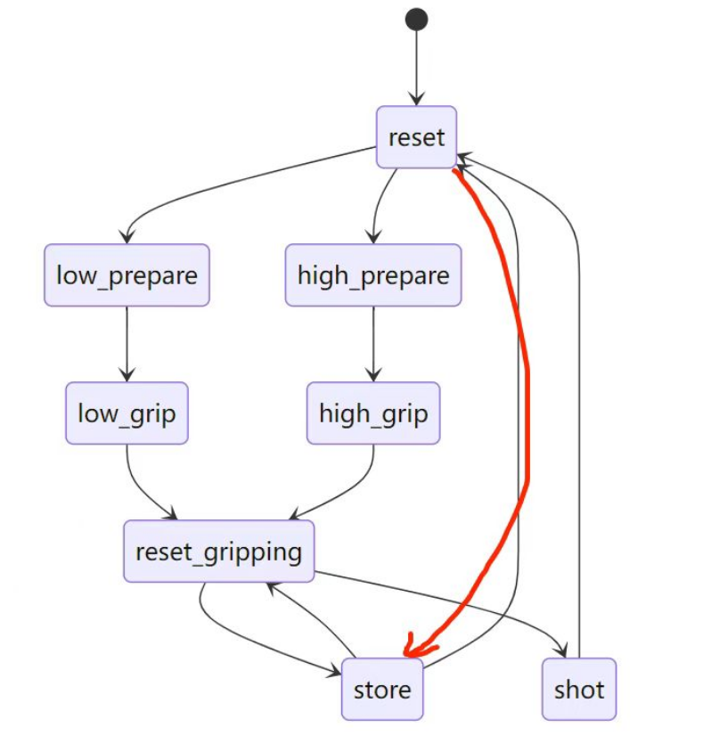

# 电控子模块（ele_control）技术文档

该文档描述 `electric_control` 下的代码结构、主要软硬件模块、硬件 IO 映射、以及与 PC 的串口通信协议（frame + TLV）。

> 项目基于`libraries/`（SeekFree/厂商库）开发，这些库的内部实现不在本文档中详述，仅说明如何使用本目录下的接口。

---

# 目录

- [电控子模块（ele\_control）技术文档](#电控子模块ele_control技术文档)
- [目录](#目录)
- [概述](#概述)
- [硬件模块](#硬件模块)
  - [主板](#主板)
  - [电机驱动](#电机驱动)
  - [舵机转接板](#舵机转接板)
  - [PCB设计](#pcb设计)
    - [布局规划](#布局规划)
    - [布线规范](#布线规范)
    - [电源监控和管理](#电源监控和管理)
    - [功率分配](#功率分配)
  - [元件选型](#元件选型)
    - [核心器件](#核心器件)
    - [被动元件](#被动元件)
    - [连接器](#连接器)
- [代码结构](#代码结构)
  - [执行器](#执行器)
    - [底盘控制 (guandao)](#底盘控制-guandao)
    - [推送装置 (push)](#推送装置-push)
    - [机械臂控制 (roboarm\_motion)](#机械臂控制-roboarm_motion)
    - [云台和发射控制 (shot)](#云台和发射控制-shot)
  - [串口通信及通信协议](#串口通信及通信协议)
    - [概要](#概要)
    - [Frame 层（边界、长度与校验）](#frame-层边界长度与校验)
    - [Data 层 \& TLV（变量封装）](#data-层--tlv变量封装)
    - [Variable 层（VAR ID 与语义）](#variable-层var-id-与语义)
    - [解析与分发（在 MCU 端的实现细节）](#解析与分发在-mcu-端的实现细节)
- [`user/cpu0_main.c` 执行流程说明](#usercpu0_mainc-执行流程说明)
  - [初始化阶段](#初始化阶段)
  - [主循环](#主循环)
---

# 概述

`ele_control` 是机器人电控（MCU 端）代码的用户层实现，基于项目内提供的硬件抽象与第三方库（libraries）。本目录负责：

- 车辆底盘与电机驱动（`guandao.*`）
- 弹仓推进装置（`push.*`）
- 机械臂（`roboarm_motion.*`）
- 发射装置（`shot.*`）
- 与上位机（PC）基于自定义 frame + TLV 协议的收发（`communicate/*`）

本技术文档聚焦代码结构、接口与协议，便于移植、调试与二次开发。

# 硬件模块

## 主板

**主电源输入**
- 输入接口：XT30电源插座，type_c 5V输入，都可以防反接
- 输入电压：5V DC ±10%
- 过压保护：PMOS管 HY19P03D，稳压管BZT52C16产生压差用

<div align="center">
<figure>
    
    <figcaption></figcaption>
</figure>
</div>

**DC-DC转换电路**
- 外部稳压 24V转5V
- 3.3V转换：RT9013-33GB-MS
  - 输出电流：1A
  - 输入范围：4.5V-12V
<div align="center">
<figure>
    
    <figcaption></figcaption>
</figure>
</div>

## 电机驱动
**双路H桥驱动模块**
- 输入电压范围6-26V，元件选型用贵一点就，不用再画降压电路了直接用BZT52C3V3给芯片供电。
- 驱动芯片：DRV8701E和双H桥
- MOS管：东芝的TPH1R403NL，内阻低，过流能力极强，理论上可以过50A电流
  
<div align="center">
<figure>
    
    <figcaption></figcaption>
</figure>
</div>

- 使用缓冲芯片
<div align="center">
<figure>
    
    <figcaption></figcaption>
</figure>
</div>

## 舵机转接板
**电源接口**
- 电平转换：外部使用现成模块24V转6.5V
- 滤波：电容滤波

**PWM输出**
- 缓冲器：74HC125总线驱动器（后面因为元件数没备够删了）
- 限流电阻：100Ω串联保护


## PCB设计

### 布局规划

**电源区域**
- 特征：大面积铺铜，多路电源分区
- 散热：电源芯片带散热过孔

**信号区域**
- 布线：大电流路径加宽至40mil
- 隔离：数字地与功率地单点连接

### 布线规范
**电源布线**
- 主电源：60mil线宽，承载3A电流
- 电机电源：80mil线宽，承载6A电流
- 地平面：完整地平面，减少环路面积，同时模拟地和信号地分离

### 电源监控和管理
**电压监测点**
- 主输入：12V分压监测
- 电池电压：通过ADC1_CH5_A21监测
- 3.3V供电：直接ADC采样

**电流监测**
- 无需电流检测

### 功率分配
**总功率预算**
- 主板功耗：1.2W（3.3V@360mA）
- 所有舵机功耗：最大32.5W（6.5V@5A）
- 所有电机功耗：最大120W（24V@5A）
- 保护：分点板上的10A保险丝
- 总输入功率：150W设计余量（实际比这小的多得多）


## 元件选型

### 核心器件
**TC264微控制器**
- 封装：LQFP176
- 温度范围：-40℃ to +85℃
- 供电电压：3.3V核心，1.2V内核

**DRV8701E电机驱动**
- 封装：HTSSOP16
- Rds(on)：280mΩ典型值
- 待机电流：<1μA

### 被动元件
**电容选型**
- 详见BOM

**电阻选型**
- 详见BOM

### 连接器
**电源线接口**
- 类型：XT30连接器

**信号接口**
- 类型：2x3P,2x5P牛角座
- 间距：2.54mm间距
- 线序：使用灰排线有效防反插，方便整理线路，不用像杜邦线那么麻烦。


# 代码结构

本次RG任务难度高，对稳定性要求高，且不像去年（RG2024）那样有实时计算实时决策的需求。我们没有使用RTOS，也没有使用在智能车里常用的时间片轮询。

```
ele_control/
├── libraries/          # 开发中使用的底层库
├── code/
│   ├── communicate/    
│   │   ├── protocol_c  # 协议栈（frame, data, protocol_defs）
│   │   ├── parser.*    # 接收解析器
│   │   └── sender.*    # 数据发送器
│   ├── guandao.*       # IMU接收、运动模式控制、导航辅助函数
│   ├── push.*          # 送管/推弹子模块控制逻辑
│   ├── shot.*          # 开火/触发子模块
│   ├── roboarm_motion.*# 机械臂动作序列
│   └── 本文件夹作用.txt
└── user/
    ├── cpu0_main.c     # CPU0主函数（初始化流程与主循环）
    ├── cpu1_main.c     # 第二个核心程序（未使用）
    ├── cpu0_main.h
    └── isr.*           # 启动/中断相关
```

## 执行器

### 底盘控制 (guandao)

**文件**: `guandao.c / guandao.h`

**功能概述**：
IMU 串口接收解析（FIFO）、惯导（INS）基础结构、底盘 motor pattern、PWM/GPIO 控制、IMU 数据解析。

**主要接口**：
- `guandao_init()` - 底盘系统初始化
- `imu_reset()` - IMU 复位
- `motion_init()` - 运动控制初始化
- `set_motion()` - 设置运动状态
- `get_imu_yaw()` - 获取 IMU 偏航角
- `INS_UpdatePosition()` - 更新位置信息

**主要算法**：使用比较经典的惯性导航算法，使用四元数，一阶滤波器等，获取每个瞬间的加速度，实现定位功能，实际上因为积分运算和采样频率不够，以及底盘电机没有编码器，只用IMU无论如何定位都会有误差（精度在10CM这样），这样的精度是无法抓取的，最后定位工作还是靠与视觉融合定位。但是维特智能的位姿角度参数很好，可以直接使用。考虑到备赛时间和比赛时间限制，最后没在底盘采用PID算法。

### 推送装置 (push)

**文件**: `push.c / push.h`

**功能概述**：
推管/送弹逻辑（编码器读数判断极限、PWM 控制、方向 GPIO），实现精确的推送控制。

**主要接口**：
- `push_init()` - 推送装置初始化
- `push_update()` - 状态更新与监控
- `push_forward_and_back()` - 前进后退控制
- `push_set_speed()` - 设置推送速度
- `push_get_position()` - 获取当前位置

**主要算法**：
编码器闭环控制。

### 机械臂控制 (roboarm_motion)

**文件**: `roboarm_motion.c / roboarm_motion.h`

**功能概述**：
机械臂动作序列控制，包括抓取、准备、回位等预设动作，通过调用底层舵机接口实现精确运动控制。

**主要接口**：
- `roboarm_init()` - 机械臂初始化
- `roboarm_grab()` - 执行抓取动作
- `roboarm_prepare()` - 准备姿态
- `roboarm_reset()` - 回位动作
- `roboarm_set_angle()` - 设置关节角度
- 还有很多

**主要算法**：
由于机械臂稳定性和分辨率不足，没有使用视觉机械臂动态控制位置和逆运动学分析，而是使用视觉精确找到底盘位置后，调用机械臂状态机抓取。
- 有限状态机
 <div align="center">
<figure>
    
    <figcaption></figcaption>
</figure>
</div>


### 云台和发射控制 (shot)

**文件**: `shot.c / shot.h`

**功能概述**：
开火/触发控制模块，管理摩擦轮速度控制、单发/连发模式、发射时序等。

**主要接口**：
- `shot_init()` - 发射系统初始化
- `shot_fire_once()` - 单发射击
- `shot_fire_continuous()` - 连发射击
- `shot_stop()` - 停止射击
- `shot_set_speed()` - 设置摩擦轮速度

**主要算法**：
- 由于无刷电机转速对电压比较敏感，这里没有采用开环控制，而是在视觉找定位置后，使用ADC反馈的电压调整PWM输出参数。
- 云台融合视觉，通过前置摄像头看绿灯，使用PID迭代调整位置，最终高台打大本营的精度可以达到3中2（到最后都没时间打出去）。

---

## 串口通信及通信协议
### 概要

本系统在 MCU 与上位机之间采用轻量、可扩展的三层串行协议：Frame 层负责帧边界与完整性校验；Data 层以 TLV（Type-Length-Value）格式组织多个变量；Variable 层负责变量 ID、固定宽度约束与语义映射。该设计兼顾了传输可靠性、协议可演进性与上位机/嵌入式端实现复杂度的平衡。

以下内容同时引用并说明工程中的实现位置：
**协议层**：`communicate/protocol_c/frame.*`（frame 层）、`communicate/protocol_c/data.*`（TLV 编解码）、`communicate/protocol_c/protocol_defs.h`（变量与固定宽度表）
**应用层**：`communicate/parser.*`（流式解析与分发）、`communicate/sender.*`（发送封装）。

---

### Frame 层（边界、长度与校验）

帧定义（字节序列）为：

```
0xAA | LEN | VER | SEQ | CHK | DATA[LEN-3]... | 0x55
```

- LEN（1 字节）：等于 3 + N，其中 N 为 DATA 字节数（VER+SEQ+CHK 之外的 DATA 长度）。因此 DATA 的最大字节数为 252（0xFF - 3）。
- VER（1 字节）：协议数据版本（与 `protocol_defs.h` 中的 PROTOCOL_DATA_VER 匹配用于向后兼容检查）。
- SEQ（1 字节）：报文序列号，用于上位机/MCU 区分重复帧和检测丢包。
- CHK（1 字节）：帧头后到 DATA 前一段的校验（实现文件 `frame.c` 中有校验算法，接收端在解析时会验证，错误返回 PCMCU_ECHECKSUM）。
- HEAD/TAIL：头（0xAA）与尾（0x55）作为定界符。

实现要点：
- 使用 `pcmcu_build_frame()` 构建帧并返回完整字节序列；使用 `pcmcu_stream_feed()` 在接收端以流式方式喂入字节缓冲，库会在找到完整帧后回调 `pcmcu_on_frame_fn`。
- 流式解析器使用固定大小的内部缓冲（`PCMCU_STREAM_MAX_BUF`，默认 512）；当缓冲溢出或出现格式错误时，解析器会丢弃最早的字节以保持对“最新数据”的偏好（left-trim 策略）。
- 错误码：frame 层会返回详细错误码（如 PCMCU_ELEN_INVALID / PCMCU_EFRAME_TOO_SHORT / PCMCU_ECHECKSUM），上层应根据需要记录或回报错误。

---

### Data 层 & TLV（变量封装）

Data 层使用 TLV（1B Type, 1B Length, L bytes Value）打包任意多个变量项到 DATA 区域。为减少解析与校验开销，工程同时维护了一个固定宽度表 `VAR_SIZE_TABLE[256]`，当某个变量在表中对应非零值时，接收端会强制要求 L 等于该固定值（避免长度混淆与类型不匹配）。

核心 API（定义在 `data.h`）：
- `data_put_u8/u16le/u32le/f32le()`：写入基础类型为一个 TLV 项。
- `data_put_tlv(buf, cap, w, t, v, l)`：在缓冲 `buf` 的写指针 `w` 处写入一项 TLV，返回新写指针或错误。
- `data_put_var(...)`：根据 `VAR_SIZE_TABLE` 校验固定宽变量并写入；若长度与表不匹配，返回 DATA_ESIZE 错误。
- `data_encode(msg, ver, tlv_bytes, tlv_len, out_buf, out_cap, &out_data_len)`：在给定 tlv 字节序列情况下，构建 DATA 区域（含消息类型/版本等）供 frame 层封装。
- `data_decode(data, data_len, &out_msg, &out_ver, on_tlv_cb, user)`：解码 DATA 中的所有 TLV，每遇到一项即调用 `on_tlv_cb(t, v, l, user)`；回调返回非 0 时可提前中止解析。

设计与鲁棒性要点：
- 对于固定宽变量，务必通过 `data_put_var` 或 `data_put_var_f32` 等接口构建，这样编解码两端长度约束一致。
- `data_validate_tlvs()` 可用于对未知/外部数据做快速一致性检查（检查边界、长度与不越界）。

### Variable 层（VAR ID 与语义）

变量 ID 与固定宽度定义在 `protocol_c/protocol_defs.h`，该文件由生成脚本维护。每个变量包括：
- 名称（宏名，如 `VAR_FRICTION_WHEEL_SPEED`）
- ID（0..255）
- 固定宽度（若适用，例如 float32 占 4 字节）


完整变量表参见仓库：`electric_control/ele_control/protocol_vars.csv`。

### 解析与分发（在 MCU 端的实现细节）

核心流程（基于 `parser.c` 的实现）：

1. 串口中断/底层驱动将接收字节写入软 FIFO（ISR 中只做最小处理）。
2. 主循环或专用任务从 FIFO 中批量读取字节并调用 `parser_feed_stream(data, len)`。
3. `pcmcu_stream_feed()` 在内部累积字节并在发现完整帧时回调 `on_frame_callback(frame, frame_len, user)`。
4. `on_frame_callback` 调用 `pcmcu_parse_frame_data()` 抽取 DATA 字段，然后调用 `data_decode()` 遍历 TLV 项。
5. `data_decode` 在遇到每一项 TLV 时，触发 `on_tlv_callback(t, v, l, user)`；该回调负责将变量分发到具体模块（底盘/推送/射击/机械臂等），并将需要的响应写入响应缓冲（例如 `add_response_to_buffer`）。
6. 当前帧处理完毕后，若响应缓冲非空，调用 `sender_send_multiple_tlv()` 将所有响应打包并通过发送回调写出串口。


---

# `user/cpu0_main.c` 执行流程说明

## 初始化阶段

1. **基础初始化**：
   - `clock_init()` - 时钟初始化
   - `debug_init()` - 调试串口初始化

2. **协议与解析器初始化**：
   - `sender_init(sender_callback, NULL)` - 发送器初始化
   - `parser_init()` - 解析器初始化

3. **模块初始化**：
   - `guandao_init()` - 底盘初始化
   - `push_init()` - 推送模块初始化
   - `roboarm_init()` - 机械臂初始化
   - `shot_init()` - 射击模块初始化

4. **等待其他核就绪**：
   - `cpu_wait_event_ready()`

## 主循环

```c
while (1) {
    // 从串口环形缓冲读取数据
    debug_read_ring_buffer(read_data, 32);
    
    // 数据解析与处理
    if (有数据) {
        parser_feed_stream(read_data, fifo_data_size);
    }
    
    // 可选：周期性发送心跳
    // sender_send_u8(VAR_HEARTBEAT, 0x00);
}
```

**设计要点**：将 IO/外设初始化与协议栈初始化放在主函数前期，主循环仅负责把串口收数据交给解析器。


---